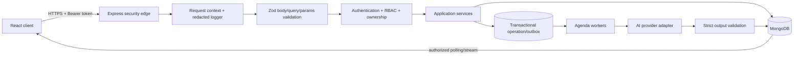
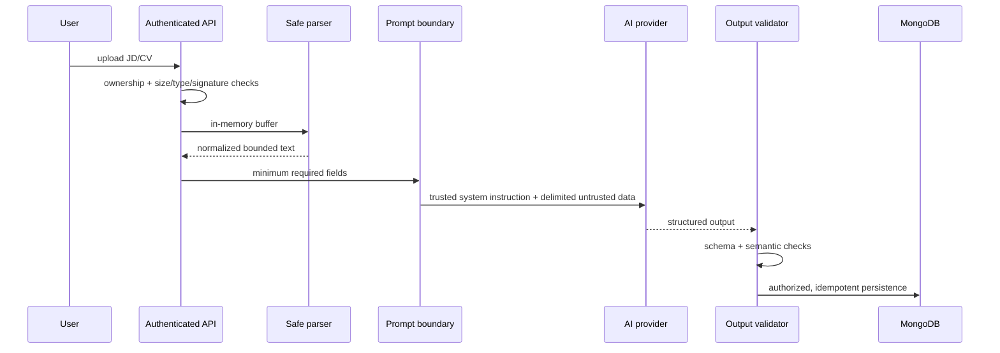

# AIP-9 — Security & Quality Assurance: thiết kế và kế hoạch triển khai

## 1. Trạng thái tài liệu

| Thuộc tính | Giá trị |
|---|---|
| Jira Epic | AIP-9 — `[V2][EPIC] Security & Quality Assurance` |
| Phạm vi | AIP-52 đến AIP-57 |
| Mức ưu tiên | P0, mục tiêu WEEK-4 |
| Repository baseline | `main` tại `448bf5272bf5bae2458b93c76228515da809d67b` |
| Ngày khảo sát | 09/09/2026 |
| Trạng thái Jira khi khảo sát | Epic và 6 task con đều `To Do` |
| Loại tài liệu | Thiết kế kỹ thuật, kế hoạch triển khai và kế hoạch nghiệm thu |

Tài liệu này là nguồn thực thi cho toàn bộ AIP-9. Nội dung Jira là yêu cầu gốc; các quyết định bên dưới cụ thể hóa yêu cầu dựa trên code hiện tại. Khi dependency thay đổi contract, cập nhật tài liệu và test trước khi triển khai phần phụ thuộc.

## 2. Mục tiêu và Definition of Done

AIP-9 hoàn thành khi hệ thống có lớp bảo vệ nhất quán ở biên HTTP, không để secret hoặc PII đi vào repository/log, cô lập dữ liệu AI/CV theo chủ sở hữu, chống ghi trùng ở luồng bất đồng bộ và chạy được các hành trình Candidate/Admin trong CI.

Epic chỉ được đóng khi đồng thời đạt các điều kiện sau:

1. AIP-52, AIP-53, AIP-54, AIP-55, AIP-56 và AIP-57 đều thỏa Acceptance Criteria.
2. Backend build, frontend lint/build, unit/integration tests, E2E và accessibility tests đều chạy trong CI.
3. Coverage tổng thể đạt tối thiểu 70%; các module auth, authorization, validation, idempotency và job handlers đạt tối thiểu 85% branch coverage.
4. Không có credential thật trong diff hoặc lịch sử mới; log tests chứng minh token, cookie, password, OTP, API key, prompt, answer và PII nhạy cảm đã bị ẩn.
5. Các API interview/result/history/admin đều kiểm tra quyền ở backend. Kiểm tra route ở React chỉ phục vụ UX, không được coi là hàng rào bảo mật.
6. Race tests chứng minh một intent nghiệp vụ không tạo trùng question, answer, evaluation, quota debit hoặc job.
7. Candidate/Admin happy paths chạy bằng Playwright với dữ liệu riêng cho từng run và Mock AI provider.
8. API/security/test/retention/rotation/runbook được cập nhật; có evidence từ CI gắn với từng task.

Ngoài phạm vi: pentest chuyên nghiệp bên ngoài, WAF/SIEM cấp doanh nghiệp, production load test toàn hệ thống và thay đổi nhà cung cấp AI.

## 3. Phạm vi Jira và dependency gates

| Jira | Nội dung | Dependency Jira | Gate trước khi bắt đầu |
|---|---|---|---|
| AIP-52 / SEC-01 | Validation, CORS, Helmet, error hardening | FND-04 | Chốt API response/error contract và cấu hình môi trường |
| AIP-53 / SEC-02 | Secrets, logs, least privilege, audit | AUTH-03, AIQ-01 | Auth contract ổn định; xác định credential dùng bởi API, Mongo, SMTP, AI và deploy |
| AIP-54 / SEC-03 | AI/CV data, prompt injection, retention | AUTH-05, AIQ-04 | Profile ownership và AI usage/audit contract đã có; policy retention được Product/Legal duyệt |
| AIP-55 / QA-01 | Auth/Profile/Configuration tests | AUTH-01…05, CFG-01…04 | Contract của các dependency đã merge; fixture factories không phụ thuộc test order |
| AIP-56 / QA-02 | AI, queue, idempotency, race tests | AIQ-01…04, INT-03…05, EVAL-01…04, QUO-01 | Queue/quota/result persistence contract đã merge; Mongo replica set khả dụng trong test |
| AIP-57 / QA-03 | Candidate/Admin E2E và accessibility | AUTH-04, INT-01, EVAL-05, HIS-02, ADM-02 | Candidate journey có history; Admin route và API cùng áp RBAC; test data seed hoàn chỉnh |

Khảo sát baseline cho thấy chưa có module History hoặc quota trong các path hiện tại. Vì vậy AIP-56 chỉ triển khai đầy đủ sau QUO-01; AIP-57 chỉ chạy đầy đủ sau HIS-02. Có thể dựng test harness và các test không phụ thuộc trước, nhưng không được đánh dấu task hoàn thành bằng mock cho một dependency production còn thiếu.

## 4. Hiện trạng và khoảng trống cần xử lý

### 4.1 Điểm đã có

- Express 5 đã dùng Helmet, Zod validation middleware và global error handler.
- Auth/Profile có integration tests với MongoDB Memory Server; có RBAC và ownership middleware.
- Upload dùng memory storage, giới hạn 5 MB và allowlist MIME PDF/DOC/DOCX.
- Test dùng Mock AI provider khi `NODE_ENV=test`.
- Interview có state machine, Agenda job scheduler, SSE và frontend autosave/timer.
- Vitest đã đặt ngưỡng coverage 70% cho một phần Auth/Profile.

### 4.2 Khoảng trống có mức ưu tiên cao

| Mức | Khoảng trống quan sát được | Tác động |
|---|---|---|
| Critical | Toàn bộ `interview.route.ts` chưa gắn `authenticate` và ownership; client còn gửi `userId` trong payload tạo session | IDOR, giả mạo chủ sở hữu, đọc/ghi session của người khác |
| Critical | Taxonomy có route create/update/delete chưa có RBAC | Candidate có thể thay đổi dữ liệu cấu hình hệ thống |
| High | CORS hiện dùng `origin: "*"` | Không đáp ứng production allowlist |
| High | Submit cập nhật từng answer rồi mới chuyển state; không có transaction/CAS/idempotency key | Partial write, double submit, duplicate evaluation |
| High | Generate có thể tạo nhiều bộ question; model chưa có unique index `(sessionId, order)` | Duplicate questions khi job được giao lại |
| High | Retry AI đang retry mọi lỗi và log `error.message`; generation log cả `setupData` | Retry sai loại lỗi và rò JD/PII/prompt context |
| High | Error handling nằm rải rác trong controller, có nơi trả trực tiếp `error.message` | Lộ chi tiết nội bộ, response contract không nhất quán |
| High | SSE dùng native `EventSource`, không gửi được Bearer header | Route stream khó bảo vệ đúng với auth hiện tại |
| High | CI chỉ lint/build, chưa chạy backend/frontend tests, E2E, accessibility hoặc secret scan | Regression có thể merge dù test không chạy |
| Medium | Upload mới tin `mimetype`, parser xử lý toàn bộ buffer trước khi cắt text | Có thể giả MIME hoặc gửi file nén/tài liệu độc hại |
| Medium | Chưa có correlation ID và logger có redaction tập trung | Khó điều tra lỗi mà vẫn bảo vệ dữ liệu |
| Medium | README nói đã chống idempotency nhưng code chỉ chặn theo state | Tài liệu tạo cảm giác bảo đảm mạnh hơn thực tế |
| Medium | Result/rubric trong code dùng 5 dimensions trong khi backlog Result đề cập radar 4 trục | Được xử lý bằng rubric versioned và bốn trục canonical ở mục 16.1 |

## 5. Kiến trúc đích và security invariants



Các invariant bắt buộc:

- Chủ sở hữu lấy từ `req.user._id`; không nhận `userId`, `ownerId`, role hoặc status nhạy cảm từ client.
- Mọi query session/question/result phải có predicate chủ sở hữu hoặc đi qua resolver ownership đã xác thực.
- Mọi mutation xác định trạng thái hợp lệ bằng atomic compare-and-set trong database; kiểm tra state trong memory không đủ.
- Một logical operation có đúng một `Idempotency-Key`, một durable operation record và tối đa một hiệu ứng nghiệp vụ.
- Job có thể được giao nhiều lần; handler phải idempotent và chỉ commit output một lần.
- Nội dung CV/JD/câu trả lời là dữ liệu không tin cậy, không bao giờ trở thành system instruction.
- Output của AI luôn là dữ liệu không tin cậy cho đến khi qua schema và semantic validation.
- Không log payload auth, raw prompt, raw answer, raw CV/JD, provider response hoặc environment object.
- Production fail closed khi thiếu CORS allowlist, secret, AI provider config hoặc retention config bắt buộc.
- Response 5xx production không chứa stack, exception name, Mongo/provider error hoặc đường dẫn máy chủ.

## 6. AIP-52 / SEC-01 — HTTP security và validation

### 6.1 Cấu hình ứng dụng

Mở rộng `src/config/env.ts` với các biến đã validate:

```text
CORS_ALLOWED_ORIGINS=https://app.example.com,https://admin.example.com
JSON_BODY_LIMIT=256kb
FORM_BODY_LIMIT=64kb
UPLOAD_MAX_BYTES=5242880
TRUST_PROXY_HOPS=1
LOG_LEVEL=info
```

Production bắt buộc `CORS_ALLOWED_ORIGINS` khác rỗng, chỉ nhận origin HTTPS hợp lệ và không nhận `*`. Development dùng allowlist localhost khai báo rõ. Do auth hiện dùng Bearer token, mặc định `credentials=false`; nếu chuyển refresh token sang cookie thì chỉ bật `credentials=true` cùng exact-origin allowlist và CSRF design riêng.

Thứ tự middleware chuẩn:

1. Tạo/kiểm tra `X-Request-Id`, chỉ chấp nhận UUID hợp lệ; nếu thiếu thì sinh UUID.
2. Gắn logger context và trả `X-Request-Id` trong response.
3. Helmet; cấu hình CSP theo tài nguyên thật của SPA, HSTS chỉ ở production qua HTTPS.
4. CORS allowlist và xử lý preflight.
5. Content-Type gate và giới hạn body riêng theo loại endpoint.
6. Parser JSON/urlencoded.
7. Routes với validation → authentication → authorization/ownership → controller.
8. API 404 và global error handler.

Không đặt upload parser trước authentication. Request trái quyền phải bị từ chối trước khi cấp bộ nhớ hoặc parse file.

### 6.2 Error contract

Tất cả lỗi API dùng một shape:

```json
{
  "success": false,
  "code": "VALIDATION_ERROR",
  "message": "Dữ liệu đầu vào không hợp lệ",
  "requestId": "d9428888-122b-11e1-b85c-61cd3cbb3210",
  "errors": [
    { "path": "body.answers.0.candidateAnswer", "message": "Không được để trống" }
  ]
}
```

Quy ước status/code:

| Trường hợp | HTTP | Code |
|---|---:|---|
| JSON/MIME/schema sai | 400 / 413 / 415 | `VALIDATION_ERROR`, `PAYLOAD_TOO_LARGE`, `UNSUPPORTED_MEDIA_TYPE` |
| Chưa đăng nhập/token sai | 401 | `AUTH_UNAUTHORIZED` |
| Sai role hoặc ownership | 403 | `AUTH_FORBIDDEN` |
| Resource không tồn tại | 404 | `NOT_FOUND` |
| State/idempotency conflict | 409 | `STATE_CONFLICT`, `IDEMPOTENCY_CONFLICT` |
| Rate limit/provider tạm lỗi | 429 / 503 | `RATE_LIMITED`, `DEPENDENCY_UNAVAILABLE` |
| Lỗi không dự kiến | 500 | `INTERNAL_ERROR` |

Controller chỉ `throw`/`next(error)`; global handler quyết định response. Validation schema dùng `.strict()` cho object, giới hạn độ dài/mảng và validate ObjectId cho params.

### 6.3 Upload hardening

- Chỉ nhận field `jdFile`, tối đa một file, tối đa 5 MB.
- Kiểm tra extension, MIME khai báo và magic bytes; ba giá trị phải tương thích.
- PDF phải bắt đầu bằng signature PDF; DOCX phải là ZIP hợp lệ chứa cấu trúc Office; DOC legacy chỉ giữ nếu parser được chứng minh xử lý an toàn.
- Giới hạn thời gian parse, số entry ZIP, tổng kích thước giải nén và text trích xuất.
- Không ghi file gốc xuống disk; xóa tham chiếu buffer sau parse; không đưa buffer vào log/error.
- Normalize Unicode, loại control characters không cần thiết và giới hạn text trước khi đưa sang AI.

### 6.4 Test AIP-52

- Table-driven tests cho body/query/params hợp lệ, thiếu, thừa, sai type, quá dài và malformed JSON.
- CORS test cho allowed, denied, missing origin và preflight trong production config.
- Header smoke test: CSP, HSTS production, `X-Content-Type-Options`, frame policy, referrer policy và không có `X-Powered-By`.
- Error test chứng minh production response không có `stack`, exception/provider/Mongo detail và luôn có `requestId`.
- Upload tests cho size boundary, MIME mismatch, forged extension/signature, malformed archive và unauthorized upload.

## 7. AIP-53 / SEC-02 — Secrets, logging và đặc quyền

### 7.1 Secret lifecycle

- Repository chỉ chứa `.env.example` với placeholder rõ ràng; `.env*` thật phải bị ignore.
- `getEnv()` là cổng duy nhất đọc cấu hình runtime. Các service nhận config đã validate qua DI, không tự đọc `process.env` rải rác.
- Tách secret theo mục đích: access JWT, refresh JWT, password reset, Mongo, SMTP, AI và deploy.
- Production service account dùng quyền tối thiểu: app Mongo chỉ CRUD collection cần thiết; migration/index job dùng credential riêng; deploy credential không được đưa vào process ứng dụng.
- GitHub Actions bên thứ ba phải pin bằng commit SHA. Secret chỉ truyền vào đúng step cần dùng; environment production có approval/protection riêng.

### 7.2 Logging contract

Dùng logger có cấu trúc với allowlist field: `timestamp`, `level`, `event`, `requestId`, `route`, `method`, `status`, `durationMs`, `actorIdHash`, `resourceType`, `resourceId`, `jobName`, `attempt`.

Redact theo key và value pattern: `authorization`, `cookie`, `set-cookie`, `password`, `passwordHash`, `token`, `refreshToken`, `otp`, `secret`, `apiKey`, `smtpPass`, email, phone, raw prompt/answer/CV/JD. Không serialize nguyên `req`, `res`, error object, environment hoặc provider response.

`console.*` trong runtime path được thay bằng logger. Error log lưu error code/class đã chuẩn hóa và requestId; message từ provider được map sang safe reason. Seed/debug scripts không được nằm trong production runtime và không được log record thật.

### 7.3 Audit và least privilege

- Admin lock/unlock ghi audit event có actor, target, action, result, requestId và timestamp; không ghi email/token.
- Thay đổi feature flag, AI model/config, retention policy và workflow nhạy cảm phải có audit event.
- Audit write failure ở action bảo mật phải fail closed hoặc dùng durable outbox; không được hoàn tất action rồi âm thầm mất audit.
- Candidate không có quyền mutation taxonomy. Taxonomy read policy được chốt là public hoặc authenticated; create/update/delete chỉ Admin.

### 7.4 Rotation runbook

Runbook phải mô tả: phát hiện → cô lập log/artifact → revoke/rotate credential → restart/redeploy → kiểm tra access bất thường → xác nhận secret scan → ghi incident. JWT rotation phải nêu cách vô hiệu hóa refresh sessions qua version/revocation; AI/SMTP/DB/deploy credential có checklist riêng.

### 7.5 Test AIP-53

- Unit tests đưa sentinel secret/PII vào request, nested error và provider failure rồi assert sentinel không xuất hiện trong log.
- Integration tests xác minh Candidate bị chặn ở Admin/taxonomy mutation và Admin action có audit.
- CI chạy secret scan trên working tree và commit range của PR; test fixture chỉ dùng chuỗi giả được allowlist có kiểm soát.
- Review cấu hình deploy chứng minh build artifact không chứa `.env`, test data, coverage hoặc raw logs.

## 8. AIP-54 / SEC-03 — AI, CV/JD và prompt injection

### 8.1 Data flow an toàn



### 8.2 Prompt contract

- System instruction là hằng số/versioned template trong code, tách khỏi user data bằng API field hoặc message role của provider.
- JD/CV/answer được gắn nhãn `UNTRUSTED_USER_CONTENT`, nằm trong delimiter có độ dài hữu hạn. Nội dung bên trong không được dùng để thay đổi tool, policy, output schema hoặc instruction priority.
- Chỉ gửi dữ liệu cần cho tác vụ. Loại contact fields, link tracking, địa chỉ, số điện thoại và metadata file nếu không phục vụ sinh câu hỏi.
- Không đưa secrets, internal configuration, audit data hoặc dữ liệu người dùng khác vào context.
- Provider output phải qua Zod schema strict: đúng 5 câu, order duy nhất 1–5, enum difficulty, text length, bilingual fields; evaluation kiểm tra questionId thuộc session, score 0–10 và không có key thừa.
- Retry chỉ dành cho lỗi tạm thời được phân loại như 429/timeout/5xx, dùng exponential backoff có jitter và giới hạn tổng thời gian. Schema/policy error không retry mù.

Prompt injection tests gồm direct override, delimiter escape, fake system message, encoded instruction, multilingual instruction, data exfiltration request và output-shape manipulation. Test pass khi system contract không đổi, không có cross-user/secret data trong prompt và output sai bị reject.

### 8.3 Ownership và retention

- File gốc: memory-only trong request, không persist; giải phóng sau parse dù thành công hay lỗi.
- Text trích xuất: gắn `ownerId`, `sessionId`, `createdAt`, `purgeAt`; chỉ đọc qua owner-scoped repository.
- Answer/evaluation: chỉ lấy qua session owner; Admin không mặc định được đọc nội dung ứng viên.
- Deletion job dùng predicate chính xác, idempotent, có audit tổng hợp và test trên database disposable.

Engineering default cho MVP được chốt chi tiết ở mục 16.2; Product/Legal vẫn là gate quản trị trước khi bật mutation purge trong môi trường dùng dữ liệu thật:

| Dữ liệu | Retention mặc định | Hành vi xóa |
|---|---|---|
| File upload gốc | Trong thời gian request | Không lưu |
| JD/CV extracted text | Đến khi session hoàn tất + 30 ngày | `$unset` text, giữ taxonomy không nhạy cảm |
| Answers/evaluations | 365 ngày hoặc đến khi user yêu cầu xóa hợp lệ | Xóa theo user/session trong job idempotent |
| Application logs | 30 ngày | Lifecycle policy, dữ liệu đã redact |
| Security/admin audit | 365 ngày | Xóa theo policy audit đã duyệt |

Không triển khai TTL trực tiếp lên document cha nếu cần giữ summary. Dùng `purgeAt` và scheduled purge để xóa chọn lọc field/child records, có dry-run metric và alert lỗi.

## 9. AIP-55 / QA-01 — Auth, Profile và Configuration tests

Fixture factory tạo user/session/taxonomy riêng theo test; mỗi test tự setup và teardown database disposable, không dựa vào thứ tự hoặc record seed dùng chung.

| Nhóm | Happy path | Negative/security path |
|---|---|---|
| Register/Login | register, login, response DTO | duplicate email, unknown field, weak/oversized input, locked user, no password/token in response/log |
| Refresh/Logout | rotation, original request recovered | replay old refresh, concurrent refresh, expired/revoked token, logout idempotent |
| RBAC/Ownership | owner reads/updates; Admin route works | cross-user IDOR, forged ownerId/role, Candidate Admin route, malformed ObjectId |
| Profile | persist/reload, allowed URLs | wrong protocol, internal field injection, cross-user update, sensitive field serialization |
| Taxonomy | list/filter valid values | unauthorized mutation, invalid ID/code, inactive item, pagination boundary |
| Setup | valid role/level/technologies, JD upload | missing/unknown/inactive IDs, duplicate technologies, limit breach, invalid timer/language/strategy |
| State machine | legal transitions | every illegal transition, stale version and concurrent transition |

Mỗi failure message phải nói rõ contract bị vi phạm. Tests dùng fake clock/UUID khi cần và không gọi internet, SMTP thật hoặc AI trả phí.

## 10. AIP-56 / QA-02 — Queue, idempotency và race conditions

### 10.1 Persistence design

1. Client gửi `Idempotency-Key` cho generate, submit và các action ghi quan trọng.
2. API tạo operation record với unique index `(actorId, route, idempotencyKey)`, lưu request fingerprint, trạng thái và response reference.
3. Cùng key + cùng fingerprint trả lại kết quả hiện có; cùng key + fingerprint khác trả `409 IDEMPOTENCY_CONFLICT`.
4. Transaction thực hiện conditional state transition và ghi outbox event. Outbox có unique business key như `GENERATE:{sessionId}` hoặc `EVALUATE:{sessionId}:{submissionVersion}`.
5. Dispatcher đưa event sang Agenda. Duplicate delivery an toàn vì worker claim bằng atomic predicate và output persistence có unique indexes.
6. Worker chỉ chuyển sang `COMPLETED` sau khi toàn bộ output hợp lệ đã commit; lỗi tạm thời giữ retry metadata, lỗi vĩnh viễn chuyển `FAILED` với safe code.

Indexes tối thiểu:

- `InterviewQuestion`: unique `(sessionId, order)`.
- Operation/idempotency record: unique `(actorId, route, idempotencyKey)` và TTL chỉ sau thời gian replay policy.
- Outbox: unique `businessKey`, index `(status, nextAttemptAt)`.
- Evaluation/submission version: unique `(sessionId, submissionVersion)`.

### 10.2 Race matrix

| Tình huống | Kỳ vọng |
|---|---|
| Hai request generate đồng thời | Một transition và một bộ 5 question |
| Hai submit cùng key | Cùng operation/result; một quota debit và một evaluation job |
| Hai submit khác key cùng session/version | Một request thắng; request còn lại `409 STATE_CONFLICT` |
| Autosave chạy cùng submit | Submit snapshot nhất quán; autosave stale không ghi đè accepted answers |
| Agenda giao job hai lần | Output/usage/quota không nhân đôi |
| Worker chết sau AI call trước DB commit | Retry có thể gọi lại provider nhưng chỉ một output được commit; quota/accounting theo policy idempotent |
| Worker chết sau DB commit trước ack | Redelivery đọc completed operation và no-op |
| Provider 429/timeout/5xx | Retry bounded với jitter; không mất accepted request |
| Provider invalid JSON/schema | Không retry vô hạn; session có safe failure state/reason |
| SSE ngắt, client chuyển polling | Cả hai hội tụ về cùng persisted status/version |

Native `EventSource` hiện không mang Bearer header. Thiết kế ưu tiên chuyển stream sang `fetch` streaming có `Authorization`; polling authenticated là fallback. Không đưa access token vào query string.

Tests dùng Mock provider có scripted outcomes và barriers để điều khiển concurrency, Mongo replica set cho transactions, fake timers cho backoff và worker restart. Mỗi test assert cả response, final database state, số lần business effect, operation/outbox record và token/quota counters.

## 11. AIP-57 / QA-03 — Playwright E2E và accessibility

### 11.1 Test environment

- Thêm Playwright ở root cùng `playwright.config.ts` và `tests/e2e/`.
- CI build client/backend, chạy MongoDB disposable, đặt `NODE_ENV=test`, `AI_PROVIDER=mock`, database name riêng theo run và secret giả ngẫu nhiên.
- Seed qua CLI test support kết nối trực tiếp database test. Không tạo test-only HTTP backdoor trong production app.
- Chạy một worker trong CI mặc định để ổn định dữ liệu; chỉ tăng parallelism khi mỗi worker có database/schema riêng.
- Khi fail, lưu screenshot, trace và video theo retention ngắn; artifact không được chứa raw password/token/answer/CV.

### 11.2 Candidate journey

`register → login → setup → generate 5 questions → answer/autosave → submit → evaluation → result → history → mở lại đúng result`.

Assert thêm: reload giữ draft/timer, double-click không double-submit, route người khác bị 403, generating/failed/incomplete UI không crash và browser back/refresh không làm sai session.

### 11.3 Admin journey

`Admin login → search/filter user → lock → user bị từ chối login/refresh → unlock → user đăng nhập lại`.

Assert thêm: Candidate không thấy/truy cập Admin; search/filter/page không mất sau action; confirm modal khóa khi request đang chạy; audit record được tạo; UI không render field nhạy cảm.

Lưu ý baseline: `/admin/users` đang nằm trong ProtectedRoute cho Candidate/Interviewer/Admin, còn `/admin/metrics` mới chỉ Admin. Phải sửa route policy và có E2E regression test.

### 11.4 Accessibility

Dùng `@axe-core/playwright` trên login, register, setup, interview room, result, history, Admin users và Admin metrics. Gate CI không có violation mức `serious` hoặc `critical`.

Ngoài automated scan, test keyboard-only cho tab order, selector, modal focus trap/restore, submit, language toggle và question navigation; test accessible name, error association, live region cho loading/error/success, chart textual fallback, contrast và reduced-motion behavior.

## 12. File ownership dự kiến khi triển khai

Danh sách này là baseline để chia PR và tránh scope drift; chỉ thêm path sau khi cập nhật plan/acceptance criteria.

| Workstream | Path chính |
|---|---|
| SEC-01 | `src/app.ts`, `src/config/env.ts`, `src/middlewares/error.middleware.ts`, `src/middlewares/validate.middleware.ts`, `src/middlewares/request-context.middleware.ts`, `src/validators/interview.validator.ts`, `tests/http-security.integration.test.ts`, `tests/interview-validation.integration.test.ts` |
| SEC-02 | `src/infrastructure/logging/logger.ts`, `src/utils/redaction.ts`, runtime files đang dùng `console.*`, auth/admin audit paths, `.env.example`, `.github/workflows/ci.yml`, `docs/security-runbook.md` |
| SEC-03 | `src/middlewares/upload.middleware.ts`, parsers, `src/services/ai/prompt-security.ts`, AI providers, interview models/repositories/services, `tests/ai-data-protection.test.ts`, `docs/data-retention.md` |
| QA-01 | `tests/auth.integration.test.ts`, `tests/authorization.integration.test.ts`, `tests/profile.integration.test.ts`, taxonomy/setup/state tests, shared fixture factories, Vitest config |
| QA-02 | interview models/repository/service, state handlers, Agenda scheduler/handlers, operation/outbox models, `tests/interview-concurrency.integration.test.ts`, `tests/ai-provider.contract.test.ts` |
| QA-03 | `playwright.config.ts`, `tests/e2e/**`, client auth/route/interview/result/history/admin paths, `.github/workflows/ci.yml`, package manifests/lockfiles |

Dependency hoặc lockfile thay đổi phải được review riêng. Không sửa Jira, commit, push hoặc deploy trong các bước triển khai nếu chưa có ủy quyền tương ứng.

## 13. Thứ tự triển khai đề xuất

### Phase 0 — Chốt contract và baseline

1. Xác nhận các quyết định mặc định ở mục 16, error envelope và route authorization matrix; chỉ thay đổi khi owner nêu rõ lý do và cập nhật test contract.
2. Lập inventory toàn bộ endpoint, log statement, secrets, data collections và async effects.
3. Chạy baseline build/test; ghi lại test đang pass/fail và coverage hiện tại.
4. Bổ sung test skeleton và fixture factories, chưa thay behavior.

Exit: không còn dependency/contract mơ hồ ảnh hưởng schema hoặc E2E.

### Phase 1 — SEC-01

1. Request context, error contract, content-type/body limits.
2. CORS/Helmet production policy.
3. Zod strict schemas cho route quan trọng.
4. Gắn auth/RBAC/ownership vào interview và taxonomy mutations.
5. Upload validation sau authentication.

Exit: AIP-52 tests pass; không còn interview IDOR trong route inventory.

### Phase 2 — SEC-02 và SEC-03

1. Logger/redaction và thay runtime `console.*`.
2. Secret scan, deploy credential review, audit durability và rotation runbook.
3. Prompt boundary, data minimization, strict provider output schema.
4. File signature/parser limits và retention/purge implementation sau khi policy được duyệt.

Exit: sentinel leakage tests, prompt tests, ownership và retention tests pass.

### Phase 3 — QA-01 và QA-02

1. Hoàn thiện Auth/Profile/Configuration matrix.
2. Triển khai operation record, CAS, unique indexes và transactional outbox.
3. Script Mock AI outcomes, retry/failure tests và concurrency barriers.
4. Test double delivery, restart recovery, quota/idempotency và SSE/poll convergence.

Exit: test lặp ít nhất 10 lần không flaky; database final state và counters đúng.

### Phase 4 — QA-03 và CI gate

1. Playwright environment/seed.
2. Candidate/Admin journeys và negative authorization.
3. Axe scans và keyboard assertions.
4. CI jobs, artifacts an toàn, coverage/secret gates và branch protection.

Exit: clean checkout chạy toàn bộ pipeline; retry không che test flaky.

## 14. CI pipeline mục tiêu

| Job | Lệnh/gate chính | Artifact |
|---|---|---|
| `backend-quality` | `npm ci`, build, unit/integration + coverage | JUnit/coverage summary đã loại dữ liệu nhạy cảm |
| `client-quality` | `npm ci --prefix client`, lint, build, tests + coverage | JUnit/coverage summary |
| `security-scan` | secret scan, dependency review trên PR | Report không chứa secret value |
| `e2e` | Playwright Candidate/Admin/a11y với Mongo + Mock AI | Trace/screenshot chỉ khi fail, retention ngắn |

Không dùng `npm ci || npm install` trong CI vì fallback có thể làm lockfile drift. CI phải fail nếu lockfile không tái lập được. Actions được pin theo commit SHA, permissions đặt tối thiểu và deploy chỉ chạy sau quality gates trên revision chính xác.

## 15. Acceptance traceability

| Jira criterion | Bằng chứng bắt buộc |
|---|---|
| Invalid input có cấu trúc | Contract/integration tests cho body/query/params và error snapshot |
| Production CORS/header/no-stack | HTTP security integration test với env production cô lập |
| Secret/PII không ở repo/log | Secret scan + sentinel redaction tests + artifact review |
| Least privilege và Admin audit | RBAC tests, credential matrix, audit integration test |
| Prompt injection không thay system contract | Prompt-builder unit tests và provider contract fixtures |
| Cross-user file/AI data bị chặn | Ownership integration tests trên session/question/result/upload |
| Retention/deletion đúng | Fake-clock purge tests và documented approved policy |
| Auth/Profile/Setup không regression | QA-01 matrix và coverage report |
| Không duplicate khi race/retry/restart | QA-02 database/counter assertions |
| Candidate/Admin E2E trong CI | Playwright report trên commit/PR |
| Không có lỗi a11y nghiêm trọng | Axe report + keyboard test evidence |

## 16. Quyết định thiết kế mặc định

Các quyết định trong mục này là đề xuất chính thức để triển khai. Worker không tự đổi chúng. Nếu Product/Security owner chọn phương án khác, phải cập nhật tài liệu, OpenAPI, migration và test trước khi sửa source.

| Chủ đề | Quyết định |
|---|---|
| Radar/rubric | Tất cả session mới dùng đúng 4 trục, `rubricVersion=2`; dữ liệu 5 trục cũ giữ nguyên với `rubricVersion=1`, không tự quy đổi điểm |
| Retention | File gốc memory-only; extracted JD/CV 30 ngày sau terminal state; answer/evaluation 365 ngày; application log 30 ngày; audit 365 ngày |
| SSE auth | Dùng `fetch` streaming với Bearer token; authenticated polling là fallback; cấm token trong query string |
| File upload | Chỉ PDF và DOCX, tối đa 5 MB; bỏ `.doc` legacy khỏi allowlist |
| Quota | Atomic reserve khi operation được chấp nhận, settle một lần khi có usage hợp lệ, release nếu provider chưa được gọi; retry không debit user lần hai |
| Admin content access | Admin chỉ xem metadata/metrics; không đọc raw CV/JD/answer/prompt trong MVP |
| Idempotency | Bắt buộc `Idempotency-Key` cho generate/submit; autosave dùng optimistic version thay vì tạo operation cho mỗi lần gõ |
| Async delivery | Transactional outbox + idempotent Agenda worker; payload outbox chỉ chứa ID/version, không chứa raw answer/CV |

### 16.1 Rubric bốn trục

Canonical keys và trọng số:

| Key | Nhãn | Trọng số overall |
|---|---|---:|
| `TECHNICAL_ACCURACY` | Technical Accuracy / Độ chính xác chuyên môn | 35% |
| `PROBLEM_SOLVING` | Problem Solving / Giải quyết vấn đề | 30% |
| `COMMUNICATION` | Communication / Trình bày | 15% |
| `PRACTICAL_APPLICATION` | Practical Application / Khả năng áp dụng | 20% |

AI trả điểm từng trục từ 0 đến 10 với một chữ số thập phân và reasoning song ngữ. Backend kiểm tra đúng bốn key, không trùng, không thiếu và tính `overallScore` bằng công thức trọng số; không tin `overallScore` do provider tự trả. System Design/Best Practices được đánh giá trong Technical Accuracy và Practical Application tùy level, không là trục riêng để tránh làm sai rubric cho Intern/Fresher.

Session mới ghi `rubricVersion: 2`. Session cũ có năm trục được backfill `rubricVersion: 1` dựa trên shape hiện có và vẫn hiển thị bằng legacy renderer. Không average, đổi tên hoặc suy diễn điểm cũ. Nếu dữ liệu thiếu, UI hiển thị textual incomplete state thay vì tự tạo trục/điểm.

### 16.2 Retention và user deletion

- `terminalAt` được đặt lần đầu khi session vào `COMPLETED` hoặc terminal `FAILED`.
- `contentPurgeAt = terminalAt + 30 ngày`; purge job `$unset` extracted JD/CV và provider payload nếu còn tồn tại.
- `recordPurgeAt = terminalAt + 365 ngày`; scheduled job xóa answer/evaluation/session theo batch có giới hạn sau khi policy cho phép.
- Idempotency record giữ 7 ngày sau terminal operation; published outbox giữ metadata tối thiểu 30 ngày; raw payload không được lưu trong outbox.
- Khi user yêu cầu xóa tài khoản: khóa truy cập ngay, tạo deletion operation idempotent trong 24 giờ và hoàn tất xóa dữ liệu live trong tối đa 30 ngày. Backup không được sửa thủ công; dữ liệu hết hiệu lực theo vòng đời backup tối đa 90 ngày và không được restore riêng lẻ trừ disaster recovery.
- Mongo TTL chỉ dùng cho collection có thể xóa nguyên document như OTP/idempotency record. Field-level purge dùng scheduled job vì TTL xóa cả document và thời điểm xóa có thể trễ.

Các mốc trên là engineering default cho MVP. Product/Legal có thể thay đổi thời hạn, nhưng không được bỏ owner scoping, audit hoặc hành vi purge có kiểm thử.

### 16.3 Authenticated stream

Client thay `EventSource` bằng `fetch`:

```text
GET /api/v1/interviews/:id/stream
Authorization: Bearer <access-token>
Accept: text/event-stream
Last-Event-ID: <last-seen-version>   # khi reconnect
```

Server chạy authentication và ownership trước `flushHeaders()`. Mỗi event có:

```text
event: session.status
id: 7
data: {"sessionId":"...","status":"EVALUATING","version":7,"updatedAt":"..."}
```

Server gửi comment heartbeat mỗi 20 giây và đóng stream ở terminal state. Client reconnect tối đa ba lần sau 1/2/4 giây; nếu vẫn lỗi thì poll authenticated mỗi 5 giây. Cả stream và polling chỉ hiển thị state có `version` lớn hơn state hiện tại. `AbortController` đóng request khi unmount/logout. Khi 401, client refresh đúng một lần qua auth client rồi reconnect; refresh thất bại thì logout an toàn.

### 16.4 Upload PDF/DOCX

`.doc` bị loại vì parser hiện tại không chứng minh hỗ trợ định dạng binary legacy an toàn. UI accept chính xác `.pdf,.docx`; backend vẫn là nguồn quyết định.

- PDF: kiểm tra extension, MIME và signature `%PDF-`; giới hạn trang/text/time khi parse.
- DOCX: kiểm tra ZIP signature, tối đa 256 entries, tổng uncompressed size tối đa 20 MB, không path traversal, bắt buộc `[Content_Types].xml` và `word/document.xml`.
- Parser chạy trong worker/child có timeout 5 giây và memory cap hợp lý; lỗi trả `422 FILE_PARSE_FAILED` không kèm parser detail.
- Không lưu filename do user cung cấp ngoài safe metadata cần thiết; không log buffer hoặc extracted text.

Nếu sau MVP bắt buộc hỗ trợ `.doc`, dùng conversion service được sandbox riêng và scan malware; không đưa `.doc` trở lại parser process chính.

### 16.5 Quota reserve–settle

Quota có hai ledger độc lập:

1. `UserQuotaLedger`: một debit logic cho một operation của user.
2. `ProviderUsageAttempt`: ghi chi phí thực của từng lần gọi provider, kể cả trường hợp hạ tầng phải retry sau crash.

Luồng xử lý:

1. Validation/auth/ownership thất bại: không reserve.
2. Trong transaction chấp nhận generate/submit: tạo operation, reserve policy units, CAS session state và ghi outbox.
3. Worker chưa gọi provider mà terminal fail: release reservation.
4. Provider trả usage và output hợp lệ: ghi provider attempt, persist result rồi settle reservation đúng một lần.
5. Provider đã được gọi nhưng response không xác định do crash/network: đánh dấu `UNKNOWN`, không debit user lần hai; retry theo policy bounded và ghi attempt riêng cho platform cost.
6. Duplicate delivery đọc operation đã settled/completed và no-op.

Unique index `(userId, operationId, quotaType)` bảo đảm user ledger không trùng. Numeric units và daily limits đến từ QUO-01; AIP-9 không tự đặt số lượng quota.

### 16.6 Admin data access

Admin API chỉ trả user status, role, timestamps, counts, aggregated usage/cost và failure code đã sanitize. Raw CV/JD, answer, feedback prompt, provider response và token không có trong DTO hoặc projection.

Nhu cầu support đọc nội dung phải là tính năng break-glass sau MVP: role riêng, lý do bắt buộc, thời hạn ngắn, approval, audit không thể bỏ qua và notification cho data owner theo policy. Không dùng role `ADMIN` hiện tại làm break-glass.

## 17. Route authorization và request contracts

### 17.1 Authorization matrix

| Route group | Quyền |
|---|---|
| `GET /health` | Public; chỉ trả trạng thái và version an toàn |
| `/auth/register`, `/login`, `/refresh`, `/password/forgot`, `/password/reset` | Public endpoint có schema/rate limit; token/OTP tự xác thực request |
| `/auth/logout` | Idempotent; refresh token hợp lệ hoặc access-authenticated theo contract hiện có |
| `GET /roles`, `/levels`, `/technologies` | Authenticated Candidate/Interviewer/Admin |
| Taxonomy `POST/PUT/DELETE` | Admin only + audit |
| `/profile` | Authenticated self only |
| Interview create/get/generate/progress/submit/stream | Candidate/Interviewer và session owner; Admin không bypass |
| Result/history | Candidate/Interviewer và session owner; Admin không bypass raw content |
| `/admin/**` | Admin only; backend RBAC và frontend route policy phải trùng |

`req.user._id` là actor duy nhất. `userId`, `ownerId`, `role`, `status`, `rubricVersion`, quota fields và audit fields từ body đều bị `.strict()` schema từ chối.

### 17.2 Interview request contracts

`POST /interviews` JSON body:

```ts
{
  jobPosition: ObjectIdString;
  level: ObjectIdString;
  techStacks: ObjectIdString[]; // 1..10, unique
  language: 'VI' | 'EN';       // default VI
  secondsPerQuestion: number;  // integer 60..600
  strategy: 'STANDARD' | 'ADAPTIVE'; // default STANDARD
}
```

`ADAPTIVE` trả `409 FEATURE_DISABLED` khi feature flag tắt. Backend kiểm tra các taxonomy IDs tồn tại, active và technology phù hợp role. Response bỏ `userId` khỏi public DTO nếu client không cần.

`POST /interviews/generate-from-jd` dùng multipart với cùng fields, `techStacks` là JSON array hợp lệ và đúng một `jdFile`. Authentication chạy trước Multer. Payload thừa hoặc parse JSON sai trả 400; file type sai trả 415; quá 5 MB trả 413; file hỏng trả 422.

`POST /interviews/:id/generate` có body rỗng và header `Idempotency-Key` dài 16–128 ký tự ASCII. Session phải `PENDING`, hoặc `FAILED` với `failedStage=GENERATION` khi retry được policy cho phép.

`POST /interviews/:id/progress`:

```ts
{
  expectedVersion: number;
  answers: Array<{
    questionId: ObjectIdString;
    candidateAnswer: string; // 0..5000 cho draft
  }>; // 1..5, questionId unique và thuộc session
}
```

Autosave dùng conditional update theo `expectedVersion`. Stale version trả `409 VERSION_CONFLICT` kèm current version, không ghi đè draft mới hơn.

`POST /interviews/:id/submit` bắt buộc `Idempotency-Key` và:

```ts
{
  expectedVersion: number;
  answers: Array<
    | { questionId: ObjectIdString; state: 'ANSWERED'; candidateAnswer: string }
    | { questionId: ObjectIdString; state: 'SKIPPED' }
  >; // đúng 5 câu, mỗi question đúng một lần
}
```

`ANSWERED` yêu cầu text sau trim dài 1–5000. `SKIPPED` không nhận text. Manual submit có nút xác nhận khi còn câu skipped; auto-submit hết giờ chuyển draft rỗng thành `SKIPPED` rồi dùng chính endpoint/validation/idempotency contract này.

GET/stream routes validate ObjectId và trả 403 khi user xác thực nhưng không sở hữu session, giữ tương thích authorization convention hiện có.

## 18. Data model và atomic operations

### 18.1 `OperationRecord`

```ts
{
  actorId: ObjectId;
  action: 'GENERATE_QUESTIONS' | 'SUBMIT_ANSWERS' | 'DELETE_USER_DATA';
  targetId: ObjectId;
  idempotencyKeyHash: string; // SHA-256, không lưu raw key
  requestHash: string;        // SHA-256 của canonical validated payload
  status: 'PENDING' | 'PROCESSING' | 'SUCCEEDED' | 'FAILED';
  responseRef?: ObjectId;
  safeErrorCode?: string;
  expiresAt?: Date;
  createdAt: Date;
  updatedAt: Date;
}
```

Unique index: `(actorId, action, idempotencyKeyHash)`. Cùng key và requestHash trả operation hiện có; cùng key khác requestHash trả `409 IDEMPOTENCY_CONFLICT`.

### 18.2 `OutboxEvent`

```ts
{
  businessKey: string; // GENERATE:<sessionId>:<version> hoặc EVALUATE:<sessionId>:<version>
  eventType: 'INTERVIEW_GENERATION_REQUESTED' | 'INTERVIEW_EVALUATION_REQUESTED';
  aggregateId: ObjectId;
  aggregateVersion: number;
  operationId: ObjectId;
  status: 'PENDING' | 'LEASED' | 'PUBLISHED' | 'FAILED';
  attempts: number;
  availableAt: Date;
  leasedUntil?: Date;
  safeErrorCode?: string;
  publishedAt?: Date;
  createdAt: Date;
  updatedAt: Date;
}
```

Unique `businessKey`; index `(status, availableAt, leasedUntil)`. Dispatcher claim dùng một atomic `findOneAndUpdate`. Event chỉ chứa IDs/version; worker đọc submission/setup bằng owner-scoped internal repository.

### 18.3 `InterviewSubmission` và session version

```ts
{
  sessionId: ObjectId;
  ownerId: ObjectId;
  version: number;
  operationId: ObjectId;
  answers: Array<{ questionId: ObjectId; state: 'ANSWERED' | 'SKIPPED'; candidateAnswer?: string }>;
  answerHash: string;
  status: 'ACCEPTED' | 'EVALUATING' | 'COMPLETED' | 'FAILED';
  createdAt: Date;
  updatedAt: Date;
}
```

Unique `(sessionId, version)` và unique `operationId`. `InterviewSession` bổ sung `version`, `rubricVersion`, `failedStage`, `terminalAt`, `contentPurgeAt`, `recordPurgeAt` và `activeOperationId`.

Generate transaction: insert operation → reserve quota → update session với predicate `{_id, userId, status:'PENDING', version:expected}` → insert outbox. Submit transaction: validate snapshot → insert immutable submission → reserve quota → CAS session sang `EVALUATING` → insert outbox. Không gọi AI hoặc Agenda bên trong Mongo transaction.

Worker persist dùng transaction và predicate `activeOperationId + aggregateVersion + expected status`. Question có unique `(sessionId, order)`; evaluation có unique `(submissionId, questionId)`. Mọi duplicate-key từ retry được đọc lại và so khớp, không biến thành response 500 chung.

## 19. Migration và rollout

1. Read-only preflight thống kê session thiếu owner, duplicate `(sessionId, order)`, trạng thái không hợp lệ và shape rubric hiện hữu. Nếu có duplicate/owner thiếu, dừng migration và xuất exact IDs để owner quyết định; không tự xóa hoặc đoán owner.
2. Tạo collections operation/outbox/submission và non-unique query indexes trước.
3. Bổ sung field nullable/default-compatible vào session; backfill `version=0`, `rubricVersion=1` cho record năm trục và không sửa điểm.
4. Chạy duplicate preflight lần hai, sau đó mới tạo unique indexes. Index build failure chặn deploy.
5. Deploy backend có thể đọc legacy và v2, nhưng chỉ ghi flow v2. Auth/ownership enforcement không đặt sau feature flag.
6. Bật outbox dispatcher; theo dõi pending age, lease expiry, retry count và duplicate-key metric.
7. Deploy frontend dùng fetch streaming và rubric renderer theo version; polling giữ làm fallback.
8. Bật purge scheduler ở dry-run metrics mode, review counts, rồi mới bật mutation theo retention policy đã duyệt.

Rollback có thể tắt dispatcher, fetch stream hoặc purge scheduler; không xóa operation/outbox/submission và không quay lại route thiếu auth. Versioned reader phải giữ ít nhất qua một release sau migration.

## 20. Dependency và package scripts

Dependency đề xuất, pin exact version trong lockfile khi triển khai:

| Package | Loại | Version baseline khảo sát 09/09/2026 | Mục đích |
|---|---|---:|---|
| `pino` | runtime | `10.3.1` | Structured logger/redaction |
| `pino-http` | runtime | `11.0.0` | HTTP request context với custom safe serializers |
| `yauzl` | runtime | `3.4.0` | Kiểm tra DOCX ZIP có giới hạn |
| `@types/yauzl` | dev | `3.4.0` | TypeScript types |
| `@playwright/test` | dev | `1.63.0` | E2E runner |
| `@axe-core/playwright` | dev | `4.13.0` | Accessibility scan |

Không thêm `file-type@22` vì package ESM-only trong khi backend hiện biên dịch CommonJS; PDF signature và DOCX container được kiểm tra bằng code nhỏ, có test và `yauzl`. Giữ Zod, Helmet, Vitest, Supertest và MongoDB Memory Server hiện có.

Root scripts mục tiêu:

```json
{
  "test:unit": "vitest run --project unit",
  "test:integration": "vitest run --project integration",
  "test:coverage": "vitest run --coverage",
  "test:e2e": "playwright test",
  "test:e2e:a11y": "playwright test --grep @a11y",
  "test:ci": "npm run build && npm run test:coverage"
}
```

Client giữ lint/build/test scripts hiện tại. Playwright cài Chromium trong CI bằng command chính thức và chỉ upload trace/screenshot khi fail. Secret scan dùng Gitleaks action được pin full commit SHA; mọi GitHub Action, kể cả deploy actions hiện dùng `@master`, phải pin full SHA và khai báo `permissions` tối thiểu.

## 21. Verification commands dự kiến

```powershell
npm run build
npm test
npm run test:coverage
npm run lint --prefix client
npm run build --prefix client
npm test --prefix client
npm run test:coverage --prefix client
npx playwright test
```

Trước khi nghiệm thu cuối, chạy các command từ clean checkout với cùng Node version CI. Không dùng production secret/data. Test cần download browser/Mongo binary phải được cache hoặc provision rõ trong CI, không âm thầm fallback sang môi trường dùng chung.

## 22. Tài liệu tham chiếu

- Jira AIP-9 và AIP-52…AIP-57, truy xuất ngày 09/09/2026.
- [Express production security best practices](https://expressjs.com/en/advanced/best-practice-security/).
- [Playwright continuous integration](https://playwright.dev/docs/ci).
- [Playwright accessibility testing](https://playwright.dev/docs/accessibility-testing).
- [OWASP LLM Prompt Injection Prevention Cheat Sheet](https://cheatsheetseries.owasp.org/cheatsheets/LLM_Prompt_Injection_Prevention_Cheat_Sheet.html).
- [OWASP File Upload Cheat Sheet](https://cheatsheetseries.owasp.org/cheatsheets/File_Upload_Cheat_Sheet.html).
- [MDN EventSource constructor](https://developer.mozilla.org/en-US/docs/Web/API/EventSource/EventSource).
- [MongoDB transactions](https://www.mongodb.com/docs/manual/core/transactions/).
- [MongoDB TTL indexes](https://www.mongodb.com/docs/manual/core/index-ttl/).
- [GitHub Actions secure use](https://docs.github.com/en/actions/reference/security/secure-use).
