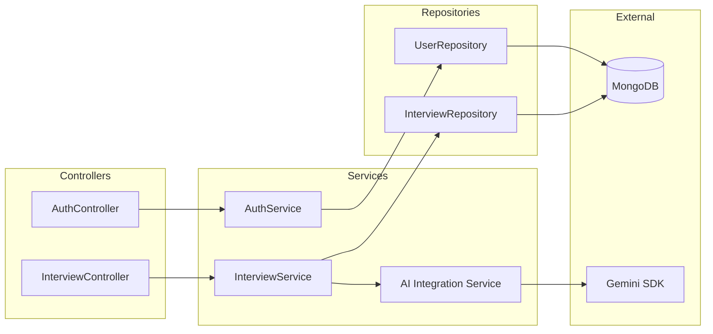
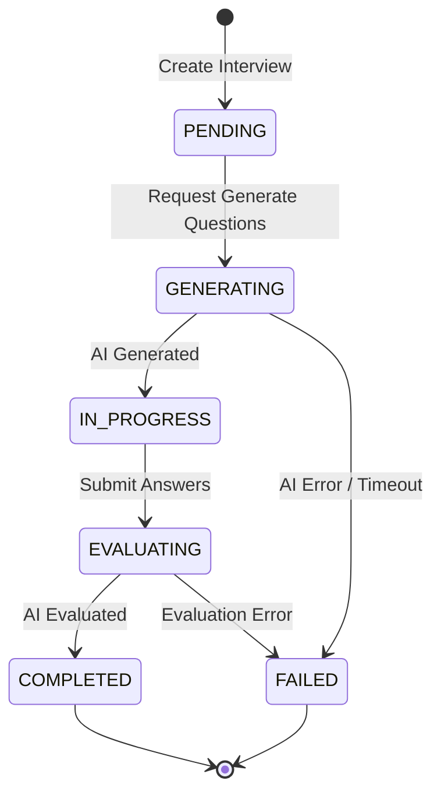

# VTI AI Interview - Kiến Trúc Hệ Thống (Architecture)

Tài liệu này mô tả kiến trúc tổng quan của dự án `VTI AI Interview`, giúp các lập trình viên nhanh chóng nắm bắt được luồng dữ liệu (Data Flow) và ranh giới các Module (Module Boundaries).

## 1. Sơ đồ Kiến Trúc Tổng Quan (High-Level Architecture)

Dự án tuân theo mô hình Client-Server kết hợp kết nối ngoài với AI Provider.

```mermaid
graph TD
    Client[Client (React/Vite)]
    API[Backend API (Express/Node.js)]
    DB[(MongoDB Replica Set)]
    AI[AI Provider (Google Gemini)]
    
    Client -- "REST (JSON) / SSE" --> API
    API -- "Mongoose (Multi-Doc Transactions)" --> DB
    API -- "REST / SDK (Gemini API)" --> AI
```

### Thành phần chính:
1. **Client**: Chịu trách nhiệm hiển thị UI/UX. Được thiết kế như một Single Page Application (SPA), gọi API về backend và lắng nghe Server-Sent Events (SSE) để cập nhật real-time khi AI đang sinh dữ liệu.
2. **Backend API**: RESTful server, là cầu nối xử lý logic nghiệp vụ, quản lý trạng thái máy (State Machine), đảm bảo an toàn giao dịch.
3. **MongoDB**: Cơ sở dữ liệu NoSQL, bắt buộc phải bật Replica Set để sử dụng Transactions (đảm bảo tính toàn vẹn khi cập nhật trạng thái phỏng vấn).
4. **AI Provider**: Google Gemini API, phân tích kỹ năng, chấm điểm và tạo câu hỏi tự động dựa trên prompt hệ thống.

## 2. Ranh Giới Module (Module Boundaries) ở Backend

Backend được thiết kế chặt chẽ theo **Layered Architecture** và áp dụng nguyên tắc SOLID (cụ thể là Dependency Inversion qua thư viện `tsyringe`).



### Mô tả từng lớp:
- **Router/Controller Layer**: Nhận Request từ Client, validate input (bằng `zod`), và gọi Service.
- **Service Layer (Domain Logic)**: Chứa toàn bộ nghiệp vụ (Core logic). Lớp này hoàn toàn không biết gì về HTTP (Req/Res) hay Database query trực tiếp. Nó tương tác với DB qua Repository Interfaces.
- **Repository Layer**: Đóng gói các câu lệnh truy vấn tới MongoDB bằng Mongoose, đảm bảo dễ dàng thay thế CSDL trong tương lai.
- **AI Service Layer**: Trừu tượng hoá logic giao tiếp với AI thành các Interface. `GeminiAiProvider` hoặc `MockAiProvider` có thể được inject lúc runtime.

## 3. Máy Trạng Thái (State Machine)
Phiên phỏng vấn được quản lý chặt chẽ theo State Pattern để tránh tình trạng Client spam request hoặc gọi sai bước.



Mỗi trạng thái (ví dụ: `PendingState`) được cài đặt bằng một class độc lập triển khai interface `IInterviewState`. Bất kỳ lệnh gọi không hợp lệ nào trong trạng thái hiện tại (vd gọi `/generate` khi đang ở `IN_PROGRESS`) sẽ bị từ chối bằng Exception.
