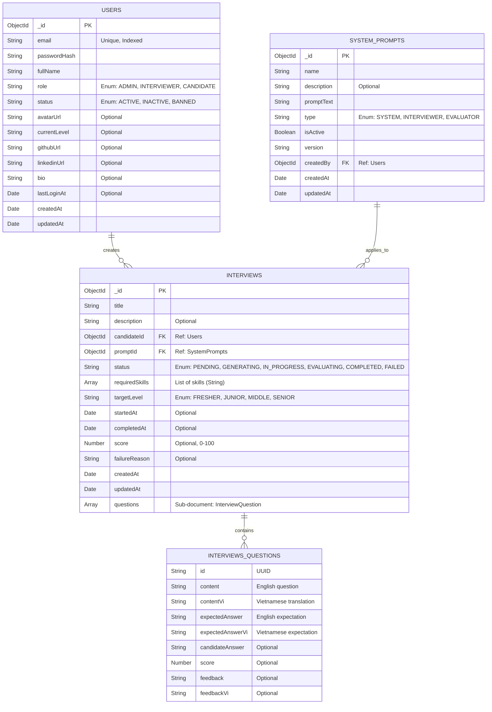

# VTI AI Interview - Data Model (MongoDB Schema Diagram)

Dưới đây là sơ đồ Mermaid mô tả các Entity (Collection) chính trong hệ thống và mối quan hệ giữa chúng, khớp với Implementation cuối ở Phase 0.

## Các Lưu Ý Về Thiết Kế Dữ Liệu:

1. **Denormalization (Phi Chuẩn Hóa)**:
   - Thay vì tạo một Collection `Questions` riêng biệt, hệ thống nhúng (embed) mảng các `questions` trực tiếp vào tài liệu `Interview`. Do số lượng câu hỏi trong mỗi phiên phỏng vấn là cố định và nhỏ (thường là 5 câu), thiết kế nhúng giúp giảm số lượng truy vấn và giảm chi phí Transaction.

2. **Indexes (Chỉ Mục)**:
   - `Users`: Đánh chỉ mục Unique trên trường `email`.
   - `Interviews`: Đánh chỉ mục trên trường `candidateId` để tăng tốc độ truy xuất lịch sử phỏng vấn của một người dùng. Đánh chỉ mục trên `status` cho mục đích thống kê và dọn dẹp các phiên bị treo.

3. **Cơ chế Soft Delete**:
   - Hiện tại hệ thống ưu tiên cập nhật trạng thái `status: 'INACTIVE'` cho Users thay vì xoá cứng (hard delete).
   - Với `SystemPrompts`, trường `isActive` dùng để vô hiệu hoá một prompt khi nó không còn phù hợp với version mới của LLM.
